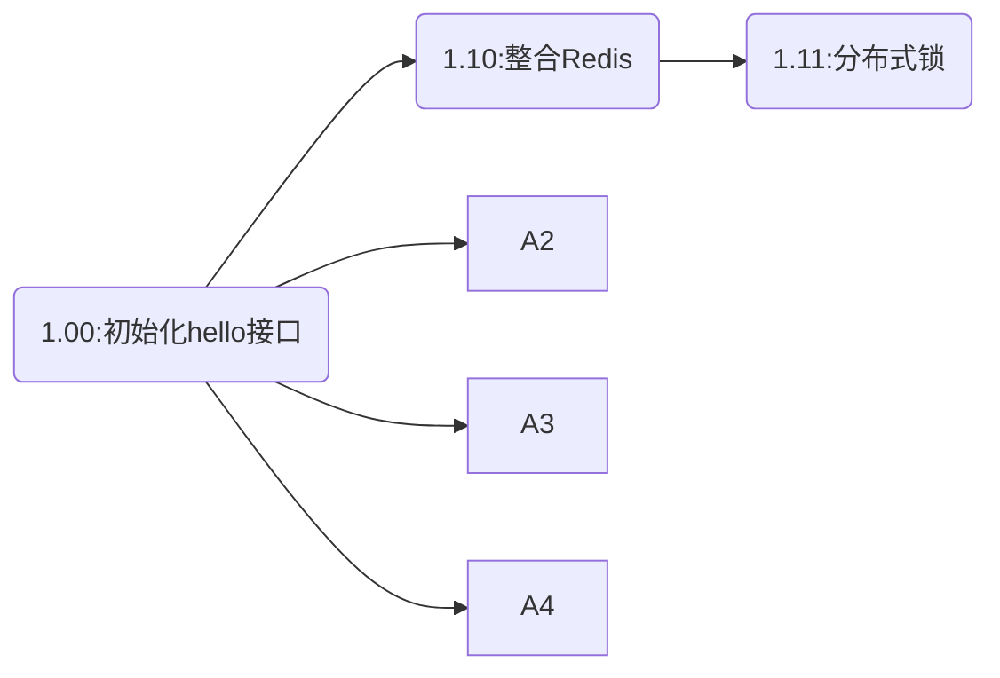

## 莫逸风企业级项目解决方案
项目版本控制说明:功能遵循极简原则，在基本SpringBoot的基础上最小依赖实现功能解决方案。

为了方便学习，会对版本进行隔离，如1.1.0基于1.0.0功能开发，学习过程中可以直接拉取1.0.0代码进行跟踪学习。
#### 1.0版本初始化

**版面：**
- SpringBoot-2.7.2
- OpenJDK-17
- MybatisPlus-3.5.2

**功能：**

- 依赖SpringWeb
- 依赖lombok
- 依赖MybatisPlus
- 依赖MybatisPlusGenerator
- 实现HelloWord接口访问

#### 1.1.0 整合Redis
