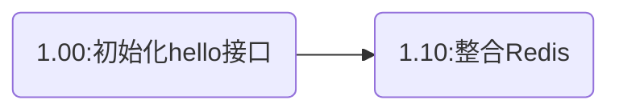
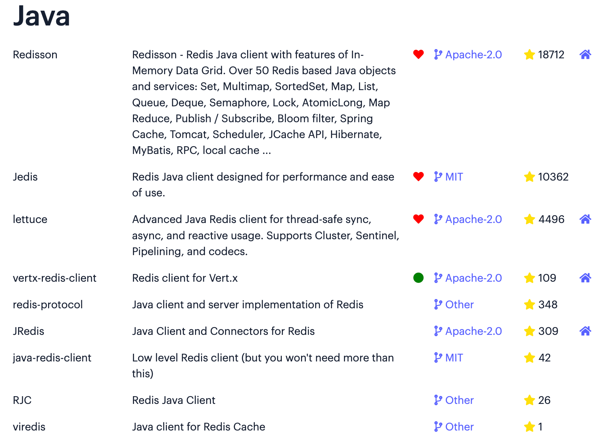
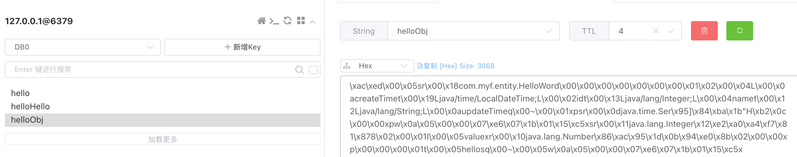
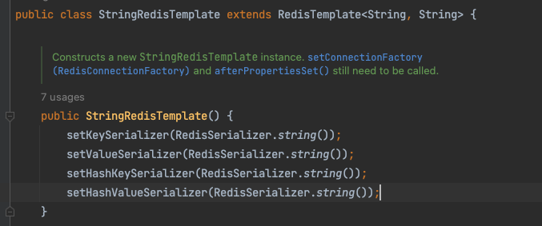

<div align="center">
    <a href="https://moyifeng.blog.csdn.net/"> </a>
    <a href="https://github.com/1046895947"> </a>
</div>

#### 版本说明（代码在GitHub）

基于simple_functions项目1.0.0分支开发



## SpringBoot整合Redis

Redis几乎是目前项目必备的缓存工具了。

java中连接Redis的方式有很多方案：[【官网Java连接Redis方式】](https://redis.io/docs/clients/#java)


为了方便使用，SpringData为我们提供了SpringDataRedis。

在 Spring Boot 中，默认集成的 Redis 就是 Spring Data Redis，默认底层的连接池使用了 lettuce ，开发者可以自行修改为自己的熟悉的，例如 Jedis。

Spring Data Redis 针对 Redis 提供了非常方便的操作模板 RedisTemplate 。

这是 Spring Data 擅长的事情，那么接下来我们就来看看 Spring Boot 中 SpringData Redis 的具体用法。

#### 引入依赖
starter和连接池
```xml
<!-- SpringDataRedis -->
<dependency>
    <groupId>org.springframework.boot</groupId>
    <artifactId>spring-boot-starter-data-redis</artifactId>
</dependency>
<dependency>
    <groupId>org.apache.commons</groupId>
    <artifactId>commons-pool2</artifactId>
</dependency>
```
#### 配置Redis信息
lettuce可以换成上面图中的其他组件
```yaml
spring:
  redis:
    host: 127.0.0.1
    port: 6379
    lettuce:
      pool:
        max-active: 100 # 连接池最大连接数（使用负值表示没有限制）
        max-idle: 100 # 连接池中的最大空闲连接
        min-idle: 50 # 连接池中的最小空闲连接
        max-wait: 6000ms # 连接池最大阻塞等待时间（使用负值表示没有限制）
    timeout: 6000ms
```

#### 编写一个工具类

[RedisUtils.java](../src/main/java/com/myf/utils/RedisUtils.java)

#### 测试
```java
@GetMapping("/hello/{value}")
public String Hello(@PathVariable String value){
    redisUtils.set("hello",value,100);
    return "设置成功";
}

@GetMapping("/getHello")
public String getHello(){
    return redisUtils.get("hello");
}
```

#### Redis序列化问题

使用RedisTemplate存储对象如果使用可视化工具查看，无法看到明确的存储内容，看到的是一串16进制字符，十分不方便。

因为其默认使用的是JDK序列化方式。这里helloObj的key不是乱码是因为我设置了key的序列化方式为String

推荐打开方式为下方配置代码中第二个，使用JSON序列化类

下面是设置方式：
```java
@Configuration
@RequiredArgsConstructor
public class RedisConfig {

    private final RedisConnectionFactory factory;

    @Bean
    public RedisTemplate<String, Object> redisTemplate() {
        RedisTemplate<String, Object> redisTemplate = new RedisTemplate<>();
        redisTemplate.setKeySerializer(new StringRedisSerializer());
        redisTemplate.setHashKeySerializer(new StringRedisSerializer());
//        redisTemplate.setHashValueSerializer(new StringRedisSerializer());
//        redisTemplate.setValueSerializer(new StringRedisSerializer());
        redisTemplate.setConnectionFactory(factory);
        return redisTemplate;
    }

    @Bean
    @Qualifier("helloWordRedisCache")
    public RedisTemplate<String, HelloWord> helloWordRedisCache(){
        RedisTemplate<String, HelloWord> redisTemplate = new RedisTemplate<>();
        redisTemplate.setKeySerializer(new StringRedisSerializer());
        redisTemplate.setHashKeySerializer(new FastJsonRedisSerializer<>(HelloWord.class));
        redisTemplate.setHashValueSerializer(new StringRedisSerializer());
        redisTemplate.setValueSerializer(new FastJsonRedisSerializer<>(HelloWord.class));
        redisTemplate.setConnectionFactory(factory);
        return redisTemplate;
    }
}
```

StringRedisTemplate默认的序列化方式就是String，因此value只能是String类型，如国上面的RedisTemplate配置中将注释部分打开其值就也只能设置为String了。


#### Demo
```java
private final RedisTemplate<String, HelloWord> helloWordRedisCache;
private final RedisTemplate<String, Object> redisTemplate;

@GetMapping("/hello/{value}")
public String Hello(@PathVariable String value){
    redisUtils.set("hello",value,100);
    HelloWord word = helloWordService.getById(1);
    redisTemplate.opsForValue().set("helloObj",word, 10, TimeUnit.SECONDS);
    helloWordRedisCache.opsForValue().set("helloHello",word, 10, TimeUnit.SECONDS);
    return "设置成功";
}
```
[【详细了解Redis序列化问题】](https://blog.51cto.com/u_15239532/2835953)
