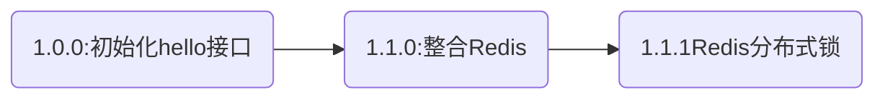

<div align="center">
    <a href="https://moyifeng.blog.csdn.net/"> </a>
    <a href="https://github.com/1046895947"> </a>
</div>

#### 版本说明（代码在GitHub）

基于simple_functions项目1.1.0分支开发


### 1. Redisson

Redisson是架设在Redis基础上的一个Java驻内存数据网格（In-Memory Data Grid）。充分的利用了Redis键值数据库提供的一系列优势，基于Java实用工具包中常用接口，为使用者提供了一系列具有分布式特性的常用工具类。使得原本作为协调单机多线程并发程序的工具包获得了协调分布式多机多线程并发系统的能力，大大降低了设计和研发大规模分布式系统的难度。同时结合各富特色的分布式服务，更进一步简化了分布式环境中程序相互之间的协作。

[【Redisson项目介绍—官方文档】](https://github.com/redisson/redisson/wiki/Redisson%E9%A1%B9%E7%9B%AE%E4%BB%8B%E7%BB%8D)

### 2. 整合Redisson

SpringBoot整合Redisson有两种方式1. 程序化配置方式。2. 文件方式配置

1. **程序化配置**

    Redisson程序化的配置方法是通过构建Config对象实例来实现的。例如：
    ```java
    Config config = new Config();
    config.setTransportMode(TransportMode.EPOLL);
    config.useClusterServers()
        //可以用"rediss://"来启用SSL连接
        .addNodeAddress("redis://127.0.0.1:7181");
    ```

2. **文件方式配置**

    Redisson的配置文件可以是或YAML格式。 通过调用`config.fromYAML`方法并指定一个`File`实例来实现读取YAML格式的配置：

    ```java
    Config config = Config.fromYAML(new File("config-file.yaml"));
    RedissonClient redisson = Redisson.create(config);
    ```

#### 2.1 引入Maven依赖

```xml
<!-- Redisson -->
<dependency>
  <groupId>org.redisson</groupId>
  <artifactId>redisson</artifactId>
  <version>3.17.3</version>
</dependency>
```

#### 2.2 自定义配置类

在Redis.config配置类中添加方法

```java
/**
 * 构建Redisson操作对象
 * @return RedissonClient
 */
@Bean(destroyMethod = "shutdown") // 服务停止后调用 shutdown 方法。
public RedissonClient redissonClient() {
  Config config = new Config();
  // 单机模式。
  config.useSingleServer().setAddress("redis://" + host + ":" + port);
  // 看门狗的默认时间。
  config.setLockWatchdogTimeout(redissonProperties.getLockWatchdogTimeout());
  return Redisson.create(config);
}
```

#### 2.3 新建DistributedLock分布式锁

```java
@Target(ElementType.METHOD)
@Retention(RetentionPolicy.RUNTIME)
@Documented
public @interface DistributedLock {
    /**
     * 锁的模式:默认自动模式,当参数只有一个使用 REENTRANT 参数多个使用RED_LOCK
     *
     * @return 锁模式
     */
    LockModel lockModel() default LockModel.AUTO;

    /**
     * 增加key的前缀
     * 设计中预将列表数组转化为多个key使用联锁——"#{#apple.getArray()}"——将数组的每一项作为一个锁。
     * "redisson-#{#apple.getArray()}" 显然会被认为是一个字符串，而不会使用联锁，应将前缀放到keyPrefix中
     */
    String keyPrefix() default "";

    /**
     * 如果keys有多个AUTO模式使用红锁
     *
     * @return keys
     */
    String[] keys() default {};

    /**
     * 租赁时间，默认为0取默认配置，-1，为无限续租。
     * @return 租赁时间
     */
    long leaseTime() default 0;

    /**
     * 等待时间，默认为0取默认配置，-1，为一直等待
     * @return 等待时间
     */
    long waitTime() default 0;
}
```

##### 2.3.1 LockModel：锁的模式

默认自动模式,当参数只有一个使用 REENTRANT，参数多个使用RED_LOCK

```java
public enum LockModel {
    /**
     * 可重入锁
     */
    REENTRANT,
    /**
     * 公平锁
     */
    FAIR,
    /**
     * 联锁
     */
    MULTIPLE,
    /**
     * 红锁
     */
    RED_LOCK,
    /**
     * 读锁
     */
    READ,
    /**
     * 写锁
     */
    WRITE,
    /**
     * 自动模式,当参数只有一个使用 REENTRANT 参数多个 RED_LOCK
     */
    AUTO
}
```

##### 2.3.2 keyPrefix设计意义

```
@DistributedLock(keys = "redisson-#{#apple.getArray()}")
```

如上的key设置，转换后会变成，redisson-a,b，无法对key进行分割为多个key。

```
@DistributedLock(keys = "#{#apple.getArray()}",keyPrefix = "redisson")
```

如果key设置为上方的方式，key将会被解析为redisson:a，redisson:b，的红锁。

##### 2.3.3 keys

可设置为数组，多个key将使用红锁，key的解析过程增加了TemplateParserContext表达式解析上下文，即"redisson-#{#apple.getArray()}"这种表达式只有#{}里面的内容会被作为SpEL表达式解析。

##### 2.3.4 leaseTime：租赁时间

默认值为0，0则取配置文件默认配置，-1则是使用看门狗机制一直续期。

##### 2.3.5 waitTime：等待时间

默认值为0，0则取配置文件默认配置，-1则代表一直等待。

#### 2.4 分布式锁AOP

实现DistributedLockAop，主要是解析keys的SpEL表达式，然后根据注解配置，对方法进行增强。

**DistributedLockAop.java**

```java
@Aspect
@Component
@RequiredArgsConstructor
public class DistributedLockAop {
  /**
     * 日志
     */
  private final Logger log = LoggerFactory.getLogger(getClass());
  /**
     * SpEL表达式
     */
  private final ExpressionParser parser = new SpelExpressionParser();
  /**
     * 表达式解析上下文，只有#{}里的内容才会被作为SqEL表达式解析
     */
  private final TemplateParserContext parserContext = new TemplateParserContext();

  private final RedissonProperties redissonProperties;
  private final RedissonClient redissonClient;

  /**
     * 切入点
     *
     * @param distributedLock 分布式锁注解
     */
  @Pointcut("@annotation(distributedLock)")
  public void log(DistributedLock distributedLock) {
  }

  @Around(value = "log(distributedLock)", argNames = "proceedingJoinPoint,distributedLock")
  public Object aroundPrintLog(ProceedingJoinPoint proceedingJoinPoint, DistributedLock distributedLock) throws Throwable {
    String[] keys = distributedLock.keys();
    if (keys.length == 0) {
      throw new LockException("keys不能为空");
    }
    String[] parameterNames = new LocalVariableTableParameterNameDiscoverer().getParameterNames(((MethodSignature) proceedingJoinPoint.getSignature()).getMethod());
    Object[] args = proceedingJoinPoint.getArgs();

    long leaseTime = distributedLock.leaseTime() == 0 ? redissonProperties.getDefaultLeaseTime() : distributedLock.leaseTime();
    long waitTime = distributedLock.waitTime() == 0 ? redissonProperties.getDefaultWaitTime() : distributedLock.waitTime();
    // 锁模式
    LockModel lockModel = distributedLock.lockModel();
    if (lockModel.equals(LockModel.AUTO)) {
      lockModel = Optional.ofNullable(redissonProperties.getDefaultLockModel())
        .orElse(keys.length > 1 ? LockModel.RED_LOCK : LockModel.REENTRANT);
    }
    if (!lockModel.equals(LockModel.MULTIPLE) && !lockModel.equals(LockModel.RED_LOCK) && keys.length > 1) {
      throw new LockException("参数有多个,锁模式为 -> " + lockModel.name() + ".无法锁定");
    }
    log.debug("锁模式 -> {},等待锁定时间 -> {}秒.锁定最长时间 -> {}秒", lockModel.name(), waitTime / 1000, leaseTime / 1000);

    boolean res = false;
    RLock rLock = null;
    switch (lockModel) {
      case FAIR:
        rLock = redissonClient.getFairLock(getValueBySpEL(keys[0], distributedLock.keyPrefix(), parameterNames, args).get(0));
        break;
      case RED_LOCK:
        List<RLock> rLocks = new ArrayList<>();
        for (String key : keys) {
          List<String> valueBySpEL = getValueBySpEL(key, distributedLock.keyPrefix(), parameterNames, args);
          for (String s : valueBySpEL) {
            rLocks.add(redissonClient.getLock(s));
          }
        }
        RLock[] locks = new RLock[rLocks.size()];
        int index = 0;
        for (RLock r : rLocks) {
          locks[index++] = r;
        }
        rLock = new RedissonRedLock(locks);
        break;
      case MULTIPLE:
        rLocks = new ArrayList<>();

        for (String key : keys) {
          List<String> valueBySpEL = getValueBySpEL(key, distributedLock.keyPrefix(), parameterNames, args);
          for (String s : valueBySpEL) {
            rLocks.add(redissonClient.getLock(s));
          }
        }
        locks = new RLock[rLocks.size()];
        index = 0;
        for (RLock r : rLocks) {
          locks[index++] = r;
        }
        rLock = new RedissonMultiLock(locks);
        break;
      case REENTRANT:
        List<String> valueBySpEL = getValueBySpEL(keys[0], distributedLock.keyPrefix(), parameterNames, args);
        //如果SpEL表达式是数组或者LIST 则使用红锁
        if (valueBySpEL.size() == 1) {
          rLock = redissonClient.getLock(valueBySpEL.get(0));
        } else {
          locks = new RLock[valueBySpEL.size()];
          index = 0;
          for (String s : valueBySpEL) {
            locks[index++] = redissonClient.getLock(s);
          }
          rLock = new RedissonRedLock(locks);
        }
        break;
      case READ:
        RReadWriteLock readLock = redissonClient.getReadWriteLock(getValueBySpEL(keys[0], distributedLock.keyPrefix(), parameterNames, args).get(0));
        rLock = readLock.readLock();
        break;
      case WRITE:
        RReadWriteLock writeLock = redissonClient.getReadWriteLock(getValueBySpEL(keys[0], distributedLock.keyPrefix(), parameterNames, args).get(0));
        rLock = writeLock.writeLock();
        break;
    }

    //执行aop
    String clasName = proceedingJoinPoint.getTarget().getClass().getName();
    String methodName = proceedingJoinPoint.getSignature().getName();
    if (rLock != null) {
      try {
        if (waitTime == -1) {
          res = true;
          //一直等待加锁
          rLock.lock(leaseTime, TimeUnit.MILLISECONDS);
        } else {
          res = rLock.tryLock(waitTime, leaseTime, TimeUnit.MILLISECONDS);
        }
        if (res) {
          return proceedingJoinPoint.proceed();
        } else {
          throw new LockException(String.format("%s.%s -- 获取锁失败", clasName, methodName));
        }
      } finally {
        if (res) {
          rLock.unlock();
        }
      }
    }
    throw new LockException(String.format("%s.%s -- 创建锁失败", clasName, methodName));
  }


  /**
     * 解析SpEL表达式
     *
     * @param key            key
     * @param keyPrefix      前缀
     * @param parameterNames 参数列表
     * @param values         值
     * @return keys
     */
  private List<String> getValueBySpEL(String key, String keyPrefix, String[] parameterNames, Object[] values) {
    List<String> keys = new ArrayList<>();
    keyPrefix = StringUtils.hasLength(keyPrefix) ? keyPrefix + ":" : "";
    if (!key.contains("#")) {
      String resultKey = redissonProperties.getRedisNameSpace() + ":" + keyPrefix + key;
      keys.add(resultKey);
      return keys;
    }
    //SpEL上下文
    EvaluationContext context = new StandardEvaluationContext();
    for (int i = 0; i < parameterNames.length; i++) {
      context.setVariable(parameterNames[i], values[i]);
    }
    Expression expression = parser.parseExpression(key, parserContext);
    Object value = expression.getValue(context);
    if (value != null) {
      // 数组列表使用联锁，key中不能含有杂质，"redisson-#{#apple.getArray()}" 显然会被认为是一个字符串，应将前缀放到keyPrefix中
      if (value instanceof List<?> valueList) {
        for (Object o : valueList) {
          keys.add(redissonProperties.getRedisNameSpace() + ":" + keyPrefix + o.toString());
        }
      } else if (value.getClass().isArray()) {
        Object[] obj = (Object[]) value;
        for (Object o : obj) {
          keys.add(redissonProperties.getRedisNameSpace() + ":" + keyPrefix + o.toString());
        }
      } else {
        keys.add(redissonProperties.getRedisNameSpace() + ":" + keyPrefix + value);
      }
    }
    log.debug("SpEL表达式key = {},value = {}", key, keys);
    return keys;
  }

}
```

[【Redisson配置—官方文档】](https://github.com/redisson/redisson/wiki/2.-%E9%85%8D%E7%BD%AE%E6%96%B9%E6%B3%95)

### 3. 概念解析

[【SimpleFunction系列二.1】渐进式理解Redis分布式锁](https://blog.csdn.net/qq_38723677/article/details/126132697)

[【SimpleFunction系列二.2】SpringBoot注解整合Redisson分布式锁](https://blog.csdn.net/qq_38723677/article/details/126307218)

[【SimpleFunction系列二.3】Redisson分布式锁8种锁模式剖析]()


